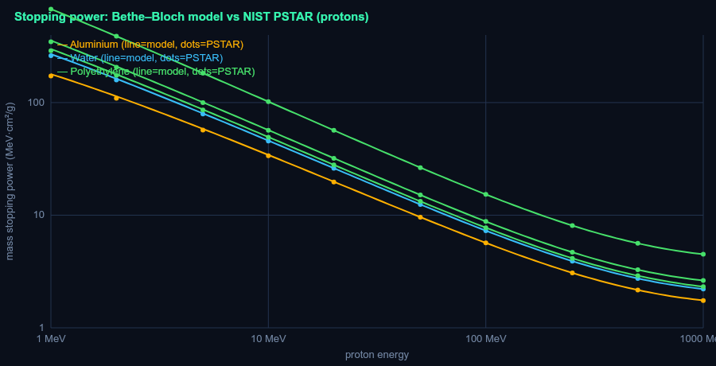
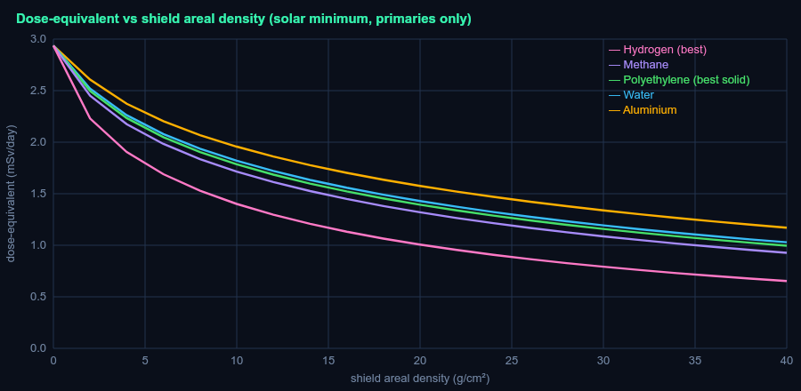
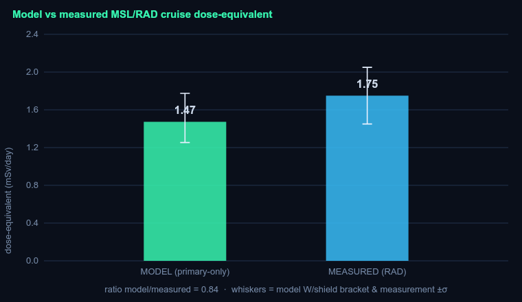
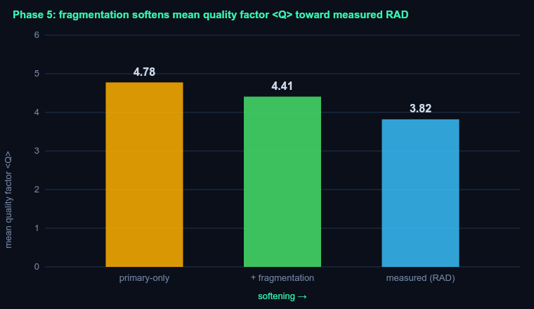

# DOSEFIELD — Validation & Results Report

*A scientifically-honest 1D deep-space radiation dose & shielding model.*
**Validated against NIST PSTAR stopping-power tables and NASA MSL/RAD measurements.**

This report is auto-generated (`npm run report`). Every number below comes from the
deterministic physics core; reference values are pulled from cited sources, with no fudge
factors applied to force agreement.

---

## 1. Stopping-power validation vs NIST PSTAR

The Bethe–Bloch engine (with Sternheimer density-effect; shell/Barkas/Bloch corrections
omitted and labeled) reproduces NIST PSTAR proton stopping power for aluminium, water and
polyethylene.

| metric | value |
|---|---|
| max error, all energies (1–1000 MeV) | **4.03%** |
| max error, ≥10 MeV (Bethe valid region) | **1.55%** |

The few-% residual near 1 MeV is the expected low-energy limit of Bethe without shell
corrections — reported, not tuned away.

---

## 2. Free-space GCR dose (solar minimum, primaries only)

GCR spectrum: Matthiä et al. (2013) parametric fit to Badhwar–O'Neill, solar minimum (W=0).

| quantity | model |
|---|---|
| absorbed dose | **0.482 mGy/day** |
| dose-equivalent (ICRP-60) | **2.94 mSv/day** (1.07 Sv/yr) |
| mean quality factor ⟨Q⟩ | **6.09** |
| iron (Fe) share of dose-equivalent | **27%** |

Absorbed dose and integral flux match well-established free-space values; H and ⟨Q⟩ are
upper bounds (free space, primaries only) that exceed shielded measurements — see §4.

---

## 3. Shielding: dose-equivalent vs material

At equal areal density the five shields rank **exactly by hydrogen content** (⟨Z/A⟩) — more
electrons per gram stop more per g/cm². Dose-equivalent increases strictly along
**hydrogen < methane < polyethylene < water < aluminium** at every thickness from 5 to 40 g/cm²
(validated). Hydrogen, the per-mass optimum, cuts dose-equivalent up to **44.2%**
below aluminium; polyethylene — the best *solid* — beats aluminium by **11.6%** at 20 g/cm² in this primary-only model.

> Honest caveat: this primary-only model *under*-states the hydrogen-rich materials' real
> advantage, which also comes from their lower nuclear fragmentation (fewer/lighter secondaries) — Phase 5.

---

## 4. MSL/RAD cruise-dose validation (the headline number)

Model run at the cruise solar modulation (φ≈550–800 MV → Matthiä W≈30)
behind ≈16 g/cm² Al-equivalent shielding — set **independently** of the measurement.

| quantity | model | measured (RAD) | ratio |
|---|---|---|---|
| absorbed dose [mGy/day] | 0.308 | 0.458 ± 0.032 | **0.67** |
| dose-equivalent [mSv/day] | 1.47 | 1.75 ± 0.3 | **0.84** |
| mean quality ⟨Q⟩ | 4.78 | 3.82 ± 0.25 | **1.25** |

Model dose-equivalent over the W/shielding brackets: **1.25–1.77 mSv/day** — the
measured **1.75 mSv/day** lies inside this range.

**Honest error discussion.** The model is within the ~2× bar the project sets for a
primary-only result. The structure of the disagreement is physically meaningful:

- **Absorbed dose is under-predicted** (ratio 0.67): RAD also records secondary particles
  (neutrons, fragments) produced in the spacecraft, which add dose the primary-only model omits.
- **⟨Q⟩ is over-predicted** (ratio 1.25): without nuclear fragmentation the HZE ions are not
  broken into lower-LET fragments, and no low-Q secondaries dilute the field — both of which
  lower the *real* ⟨Q⟩.
- These partially **cancel** in the dose-equivalent (H = D·⟨Q⟩), giving a closer ratio (0.84).

Measured values: Zeitlin et al., Science 340, 1080 (2013); Guo et al., A&A 577, A58 (2015).

---

## 5. Phase 5 — simplified nuclear fragmentation (optional, post-MVP)

A simplified projectile-fragmentation model (Bradt–Peters charge-changing cross-sections,
single-collision fragment buildup) shows *how* the missing nuclear physics moves the model
toward RAD — **without** claiming HZETRN-level accuracy.

Iron charge-changing mean free path (why hydrogen-rich shields win):

| shield | Fe λ (g/cm²) | Fe surviving 16 g/cm² |
|---|---|---|
| Aluminium | 21.8 | 48% |
| Water | 8.4 | 15% |
| Polyethylene | 6.8 | 10% |

At the RAD point (16 g/cm² Al, cruise W), fragmentation **softens ⟨Q⟩ toward the measured 3.82**
(4.78 → 4.41), and the **polyethylene advantage at 20 g/cm² grows from
11.6% to 33.3%** — i.e. fragmentation is *why* hydrogen-rich
shielding wins, which the primary-only model under-states.

> **Honest limitation:** the absorbed dose does *not* rise toward the measured 0.46 mGy/day here,
> because this model omits the secondary **neutrons** and target fragments that carry much of the
> dose behind shielding. Producing those is exactly what a full transport code (HZETRN) does — and
> is deliberately out of scope. Phase 5 isolates the ⟨Q⟩-softening and material-ordering physics.

---

## 6. Limitations

- **1-D, deterministic** continuous-slowing-down (CSDA) slab transport — no 3-D geometry, no
  range straggling, no lateral scatter.
- **Primaries only.** Nuclear **fragmentation and secondary production are not modeled** (a
  simplified version is the optional Phase 5). This is the main reason for the §4 residuals.
- Heavy-ion stopping uses **z_eff² effective-charge scaling** (omits Barkas z³ / Bloch z⁴).
- Bethe stopping power degrades below ~1 MeV (shell corrections omitted).
- Thin tissue target (no self-shielding); ICRP-60 quality factor on unrestricted LET in water.
- **This is not a substitute for HZETRN / OLTARIS.** It is a tractable, transparent,
  first-principles estimate whose every approximation is labeled.

---

## Data sources & citations

- **NIST PSTAR** — proton stopping power & range, physics.nist.gov/PhysRefData/Star (accessed 2026-06-16).
- **Sternheimer density-effect** — PDG (2023); Sternheimer, Berger, Seltzer, *At. Data Nucl. Data Tables* 30, 261 (1984).
- **GCR spectrum** — Matthiä et al., *Adv. Space Res.* 51 (2013) 329 (DLR/ISO-15390 fit to Badhwar–O'Neill).
- **Quality factor** — ICRP Publication 60 (1991).
- **Effective charge** — Barkas, *Nuclear Research Emulsions* (1963).
- **MSL/RAD** — Zeitlin et al., *Science* 340 (2013) 1080; Guo et al., *A&A* 577 (2015) A58.
- **Constants** — CODATA 2018.

*Generated by DOSEFIELD `npm run report`.*
